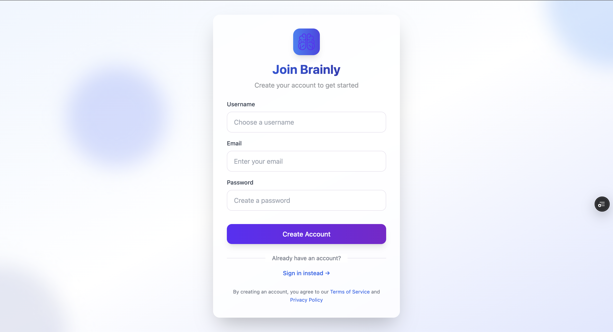
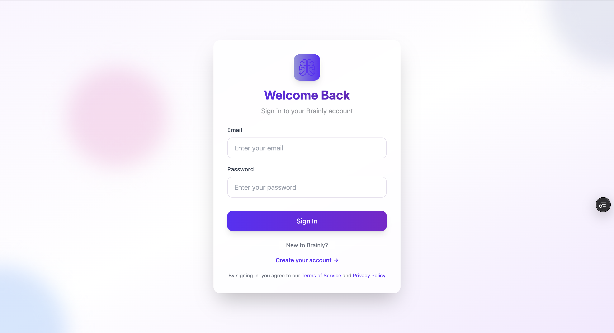
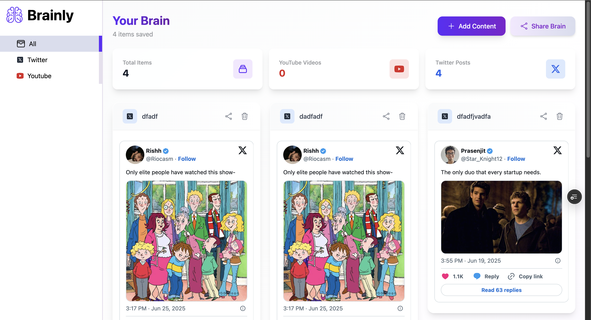
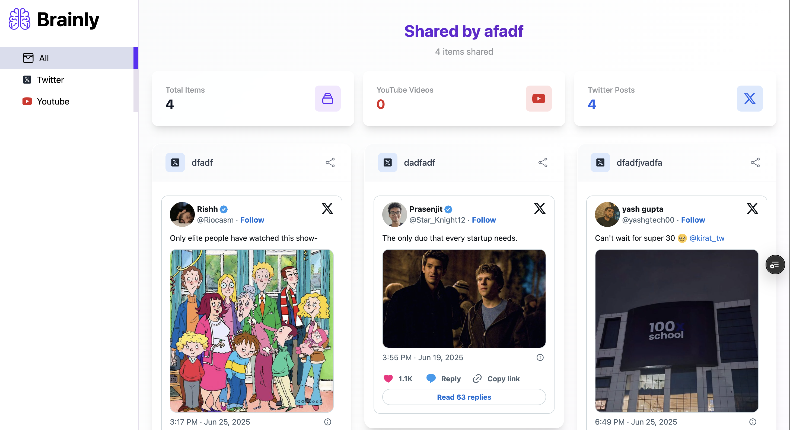
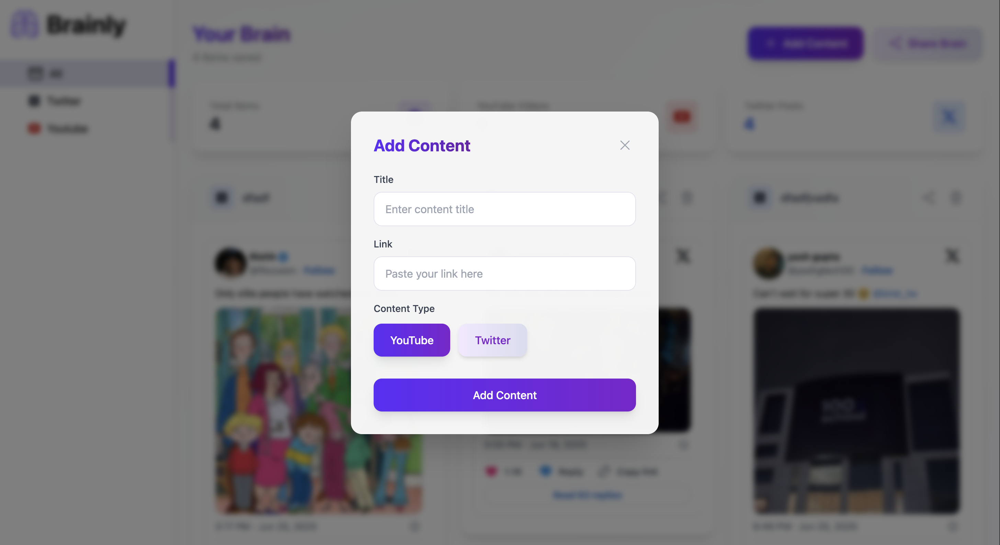

# 🧠 Brainly - Personal Content Dashboard

A modern, responsive web application that allows users to bookmark and organize their favorite YouTube videos and Twitter/X posts in one centralized dashboard. Built as a demonstration project showcasing full-stack web development skills.


## ✨ Features

- **📚 Content Bookmarking**: Save YouTube videos and Twitter/X posts with custom titles
- **🔍 Smart Filtering**: Filter content by type (All, YouTube, Twitter)
- **📱 Responsive Design**: Optimized for desktop, tablet, and mobile devices
- **🔗 Content Sharing**: Generate shareable links to your content collections
- **🎨 Modern UI**: Clean, gradient-based design with smooth animations
- **🔐 User Authentication**: Secure signup/signin with JWT tokens
- **📊 Analytics Dashboard**: View statistics about your saved content

## 🛠️ Tech Stack

### Frontend
- **React 19** - Modern UI library with latest features
- **TypeScript** - Type-safe development
- **Tailwind CSS** - Utility-first CSS framework
- **React Router DOM** - Client-side routing
- **Axios** - HTTP client for API requests
- **Vite** - Fast build tool and development server

### Backend
- **Node.js** - JavaScript runtime
- **Express.js** - Web application framework
- **MongoDB** - NoSQL database for data storage
- **JWT** - JSON Web Tokens for authentication
- **bcrypt** - Password hashing

### Development Tools
- **ESLint** - Code linting
- **PostCSS** - CSS processing
- **Autoprefixer** - CSS vendor prefixing

## 📱 Screenshots

### 🔐 Authentication Pages

#### Sign Up

*Clean and modern signup form with gradient background*

#### Sign In

*Streamlined signin experience with animated background elements*

### 📊 Dashboard

*Main dashboard showing content cards, statistics, and filtering options*


### 🔗 Share Page

*Public view of shared content collections*

### 🎯 Content Management

*Modal for adding new YouTube videos and Twitter posts*

## 🚀 Getting Started

### Prerequisites
- Node.js (v18 or higher)
- MongoDB database
- npm or yarn package manager

### Installation

1. **Clone the repository**
   ```bash
   git clone https://github.com/yourusername/brainly-frontend.git
   cd brainly-frontend
   ```

2. **Install dependencies**
   ```bash
   npm install
   ```

3. **Environment Setup**
   Create a `.env` file in the root directory:
   ```env
   VITE_BACKEND_URL=http://localhost:3000
   ```

4. **Start the development server**
   ```bash
   npm run dev
   ```

5. **Build for production**
   ```bash
   npm run build
   ```

## 🏗️ Project Structure

```
src/
├── components/          # Reusable UI components
│   ├── ui/             # Base UI components (Button, Input, etc.)
│   ├── hooks/          # Custom React hooks
│   └── CreateContentModal.tsx
├── pages/              # Page components
│   ├── Dashboard.tsx   # Main dashboard
│   ├── Share.tsx       # Public share page
│   ├── SignIn.tsx      # Authentication
│   ├── SignUp.tsx      # User registration
│   ├── TermsOfService.tsx
│   └── PrivacyPolicy.tsx
├── types/              # TypeScript type definitions
├── config.ts           # Configuration settings
└── App.tsx            # Main application component
```

## 🎨 Design Features

- **Gradient Backgrounds**: Beautiful color transitions throughout the app
- **Glass Morphism**: Frosted glass effects with backdrop blur
- **Micro-interactions**: Smooth hover states and transitions
- **Responsive Grid**: Adaptive layouts for all screen sizes
- **Dark/Light Contrast**: High contrast for accessibility

## 🔧 Key Functionalities

### Content Management
- Add YouTube videos and Twitter/X posts
- Organize content with custom titles
- Delete unwanted bookmarks
- Real-time content updates

### Filtering & Search
- Filter by content type (All, YouTube, Twitter)
- Visual indicators for different content types
- Statistics dashboard with content counts

### Sharing System
- Generate unique shareable links
- Public view without authentication required
- Maintain privacy controls

### Responsive Design
- Mobile-first approach
- Collapsible sidebar for mobile
- Touch-friendly interface
- Optimized for all devices

## 🚨 Demo Project Notice

**This is a demonstration project created for educational and portfolio purposes.** 

- Not intended for commercial use
- Use test data only
- Data may be reset periodically
- No service level guarantees

## 📄 Legal Pages

The application includes comprehensive legal documentation:
- **Terms of Service**: Clear usage guidelines for the demo project
- **Privacy Policy**: Transparent data handling practices
- **Demo Disclaimers**: Important notices about the project's nature

## 🤝 Contributing

This is a personal portfolio project, but feedback and suggestions are welcome! Feel free to:
- Report bugs or issues
- Suggest new features
- Provide design feedback

## 📧 Contact

For questions about this project or collaboration opportunities:
- **Portfolio**: [Your Portfolio URL]
- **LinkedIn**: [Your LinkedIn Profile]
- **Email**: [Your Email]

## 📜 License

This project is created for educational and portfolio purposes. Please respect the demo nature of the application.

---

**Built with ❤️ using React, TypeScript, and Tailwind CSS**